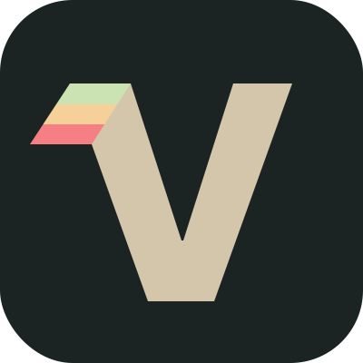

<p align="center">
  
</p>

# varium

skill-first UI variant generation for agents.

```bash
npx skills add goerll/varium
```

## What’s inside

- `skill/SKILL.md` - main skill entrypoint
- `skill/topics/` - on-demand design guidance
- `skill/assets/` - framework picker assets

## Flow

1. Ask your agent to design a section.
2. The skill detects the framework.
3. The agent generates 4+ variants.
4. The agent copies the right picker asset into the target project.
5. You review in-browser and choose one.
6. The agent keeps the winner and removes the temporary review state.

## Skill layout

```txt
skill/
  SKILL.md
  topics/
    color.md
    depth.md
    spacing.md
    typography.md
  assets/
    react/
    svelte/
    vue/
```

## Notes

- `skill/SKILL.md` is the source of truth.
- The logo lives at `assets/varium_logo.svg`.

## License

MIT. See `LICENSE`.
